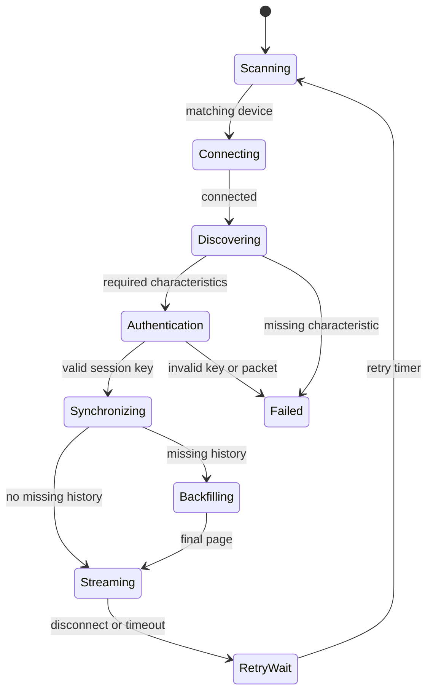

# Simulated transport and connection coordinator design

Status: pre-hardware implementation

Scope: deterministic protocol behavior without CoreBluetooth or a physical sensor

## Purpose

This layer separates BLE side effects from the SMART 2.0 / LinX protocol state machine. It allows pairing, reconnect, session-key validation, synchronization, backfill, live publication, disconnect, timeout, and retry behavior to be unit-tested before the Brazilian sensor is available.

It does not pretend to simulate radio timing or iOS bonding. Hardware capture remains authoritative for characteristic properties, notification ordering, ATT security, and command timing.

## Boundaries

`MicroTechConnectionCoordinator` consumes typed events and emits typed effects. It does not import CoreBluetooth.

`MicroTechTransportCommand` contains physical actions that a future CoreBluetooth adapter will implement:

- scan by service UUID;
- stop scanning;
- connect;
- discover characteristics;
- enable notifications;
- read;
- write with or without response;
- disconnect.

`MicroTechCoordinatorEffect` also contains application-level effects that do not belong in a BLE adapter:

- persist the long-lived master key;
- publish selected history minute indexes;
- publish a validated live-glucose packet;
- record a discarded invalid live packet;
- schedule a deterministic retry.

`MicroTechSimulatedTransport` records transport commands in order. Tests drive the coordinator with events and verify the complete command/effect sequence.

## State flow

The concrete enum contains more granular subscription and key-request states so out-of-order events can be ignored safely.

## New-pairing path

Current provisional sequence:

1. scan for service `181F`;
2. match a supported local-name family and the expected 10-character serial;
3. connect and discover F001, F002, and F003;
4. enable F001 notifications;
5. enable F002 notifications;
6. write the serial-derived 16-byte request to F001 with response;
7. receive and validate a 16-byte master key;
8. emit a Keychain-persistence effect using a redacted secret wrapper;
9. read the 17-byte encrypted session-key packet from F002;
10. decrypt it and validate CRC8/MAXIM;
11. enable F003 live notifications;
12. enter synchronization.

## Reconnect path

Current provisional sequence when a master key is already available:

1. scan, match, connect, and discover;
2. enable F003 live notifications;
3. enable F002 command notifications;
4. read and validate a new encrypted session-key packet from F002;
5. enter synchronization without touching F001.

## Synchronization and backfill

After authentication, the coordinator encrypts and queues `startTime` and `historyRange` commands with the session key.

The exact processed-history response header is still a hardware blocker. Therefore the simulator accepts high-level `historyRange` and `historyPage` events from a future decoder. This is intentional: the paging, de-duplication, no-progress protection, five-minute selection, and transition to streaming can be tested without inventing unknown bytes.

History rules:

- request from `lastReceivedMinute + 1` when state was restored;
- request the latest available minute for a fresh installation;
- reject a page whose starting index differs from the requested index;
- sort and de-duplicate indexes;
- reject indexes outside the requested/latest range;
- fail rather than loop forever when `hasMore` is true but the page makes no progress;
- pass minute indexes through the five-minute publication gate;
- request current glucose after the final page.

The simulator publishes minute indexes rather than fabricated glucose values. A real history packet decoder must supply validated processed-glucose samples after hardware capture.

## Live safety behavior

Live F003 bytes are first decrypted with the in-memory session key and a fresh serial-derived IV, then decoded by `MicroTechLiveGlucosePacket`.

- CRC failure produces a discard effect and does not advance the minute cursor.
- duplicate or older minute indexes are ignored.
- warm-up, invalid, and ended-sensor packets advance receipt state but are not published for dosing.
- a valid packet is published only when the five-minute gate accepts its sensor minute index.

## Retry policy

The default retry policy is deterministic exponential backoff:

- initial delay: 2 seconds;
- multiplier: 2;
- maximum delay: 30 seconds;
- maximum attempts: 5.

Timeout emits a disconnect command before scheduling retry. Retry counters reset only after streaming is reached or after an explicit stop/start. Protocol violations and missing characteristics enter a terminal failed state until explicitly stopped.

## Secret handling

`MicroTechSecret` enforces a 16-byte key and prints only `<redacted 16-byte secret>` through both normal and debug descriptions. Key bytes remain internal to the module and are never part of public connection state.

The simulated persistence effect is not a Keychain implementation. The future iOS adapter must persist only the master key with device-only accessibility suitable for background reconnect and must never persist the session key.

## Provisional assumptions requiring hardware confirmation

1. Exact Brazilian local-name prefix and serial suffix mapping.
2. F001/F002/F003 presence and notification/read/write properties.
3. New-pairing notification order.
4. Reconnect notification order.
5. Whether F001 returns exactly 16 master-key bytes with no framing.
6. Whether reading F002 returns exactly one complete 17-byte session-key packet.
7. Fresh IV use for every encrypted command/response.
8. Ordering and timing requirements for `startTime` and `historyRange`.
9. History page header, size, continuation semantics, and invalid-entry representation.
10. Which disconnect and protocol errors are recoverable on the Brazilian firmware.

These assumptions must be isolated in the future adapter/decoder so hardware findings do not require redesigning the coordinator.
